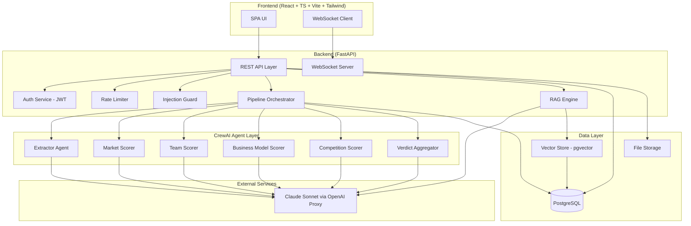
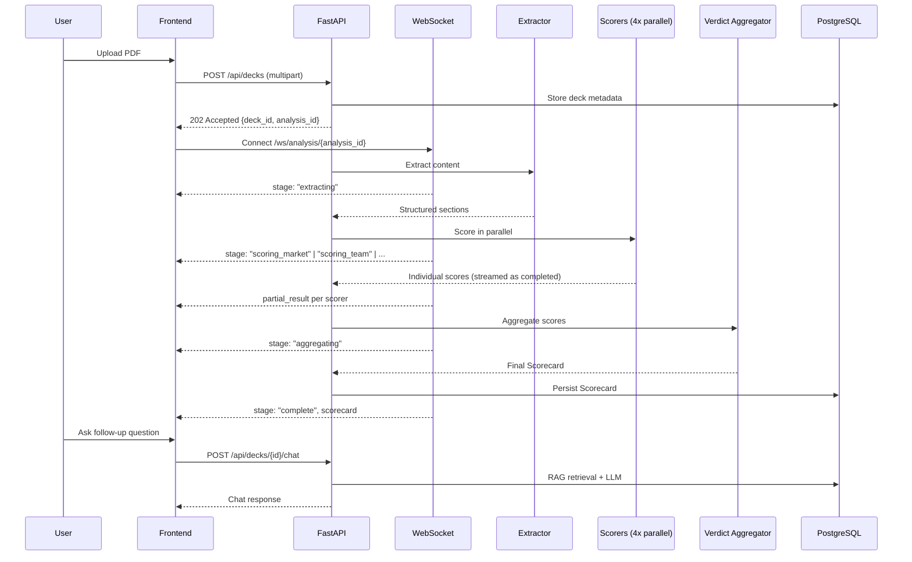
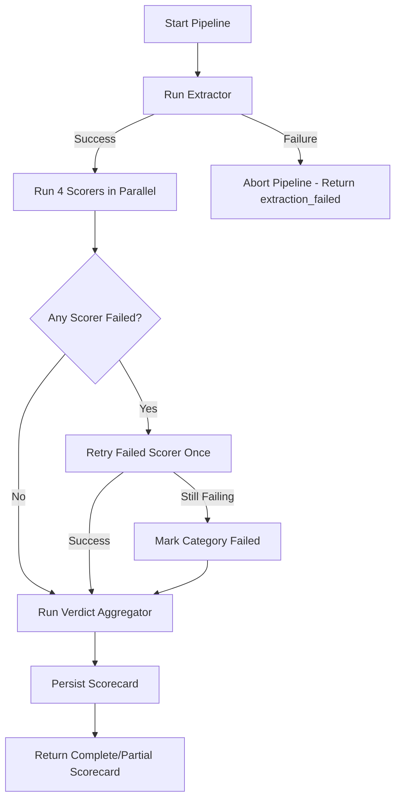

# Design Document: PitchLens Analyzer

## Overview

PitchLens is an AI-powered pitch deck analysis platform that evaluates startup pitch decks across four dimensions: market opportunity, team strength, business model viability, and competitive positioning. The system uses a multi-agent architecture powered by CrewAI, with a FastAPI backend orchestrating sequential extraction followed by parallel scoring, aggregation into a structured scorecard, and follow-up RAG-based chat.

The architecture is designed for:
- **Throughput**: Parallel scoring agents reduce total analysis time
- **Resilience**: Individual agent failure doesn't collapse the pipeline; partial scorecards are delivered
- **Real-time feedback**: WebSocket streaming keeps users informed of progress
- **Security**: JWT auth, rate limiting, and prompt injection guards protect the system

## Architecture

### High-Level Architecture Diagram



### Pipeline Flow



### Key Architectural Decisions

| Decision | Choice | Rationale |
|----------|--------|-----------|
| Agent framework | CrewAI | Provides agent composition, task chaining, and tool integration out of the box |
| LLM access | OpenAI-compatible proxy → Claude Sonnet | Standardized API interface; model swappable via env vars |
| PDF parsing | PyPDF2 | Lightweight, pure-Python, no native dependencies |
| Vector store | pgvector (PostgreSQL extension) | Collocates vector embeddings with relational data; no separate infra |
| Real-time comms | WebSocket (native FastAPI) | Low-latency bidirectional streaming without polling |
| Auth strategy | JWT access + refresh tokens | Stateless verification, standard rotation pattern |
| Rate limiting | In-memory sliding window (Redis optional for multi-instance) | Simple to implement; upgrade path to Redis for horizontal scaling |

## Components and Interfaces

### Backend Components

#### 1. REST API Layer (`app/api/`)

Exposes HTTP endpoints for authentication, deck upload, scorecard retrieval, history, and chat.

**Endpoints:**

| Method | Path | Auth | Description |
|--------|------|------|-------------|
| POST | `/api/auth/register` | No | User registration |
| POST | `/api/auth/login` | No | User login |
| POST | `/api/auth/refresh` | No | Token refresh |
| POST | `/api/decks` | JWT | Upload PDF, initiate analysis |
| GET | `/api/decks/{deck_id}/scorecard` | JWT | Get scorecard result |
| GET | `/api/evaluations` | JWT | List user's evaluation history (paginated) |
| GET | `/api/evaluations/{eval_id}` | JWT | Get specific evaluation |
| POST | `/api/decks/{deck_id}/chat` | JWT | Send follow-up question |
| WS | `/ws/analysis/{analysis_id}` | JWT (query param) | Real-time progress stream |

#### 2. Auth Service (`app/services/auth.py`)

- Handles user registration, login, token issuance and refresh
- Password hashing via bcrypt
- JWT signing with RS256 or HS256 (configurable)
- Access token TTL: 15 minutes; Refresh token TTL: 7 days

#### 3. Rate Limiter Middleware (`app/middleware/rate_limiter.py`)

- Sliding window counters per user (authenticated) or per IP (unauthenticated)
- Analysis endpoint: 10 requests/user/hour
- General endpoints: 60 requests/user/minute
- Auth endpoints: 20 requests/IP/5-minutes
- Returns 429 with `Retry-After` header on limit breach

#### 4. Injection Guard (`app/services/injection_guard.py`)

- Pattern-based scanner for known prompt injection techniques
- Scans: role-override instructions, system-prompt extraction, delimiter escapes, instruction-override commands
- Latency budget: <200ms
- Fail-closed: if guard is unavailable, requests are rejected

#### 5. Pipeline Orchestrator (`app/services/orchestrator.py`)

- Manages the analysis pipeline lifecycle
- Sequential: Extractor → Parallel: [Market, Team, BizModel, Competition] → Verdict Aggregator
- Retry logic: 1 retry per scorer on failure (30s timeout per retry)
- Total pipeline timeout: 120 seconds
- Emits WebSocket events at stage transitions and heartbeats every 5 seconds

#### 6. CrewAI Agent Layer (`app/agents/`)

Each agent is a CrewAI `Agent` with a specific role, goal, and backstory. They share a common LLM configuration.

```python
# Common LLM config
llm_config = {
    "api_key": os.environ["LLM_API_KEY"],
    "base_url": os.environ["LLM_BASE_URL"],
    "model": os.environ.get("MODEL_ID", "sonnet"),
}
```

| Agent | Input | Output |
|-------|-------|--------|
| Extractor | Raw PDF bytes | `ExtractedContent` (sections mapped to categories) |
| Market Scorer | `ExtractedContent` | `CategoryScore` (score, reasoning, suggestions) |
| Team Scorer | `ExtractedContent` | `CategoryScore` |
| Business Model Scorer | `ExtractedContent` | `CategoryScore` |
| Competition Scorer | `ExtractedContent` | `CategoryScore` |
| Verdict Aggregator | `List[CategoryScore]` | `Scorecard` |

#### 7. RAG Engine (`app/services/rag_engine.py`)

- Chunks extracted deck content into ~500-token segments
- Stores embeddings in pgvector
- On query: retrieves top-k relevant chunks, constructs context, sends to LLM
- Maintains session context (up to 20 messages)
- Grounds answers in deck content and scoring results

#### 8. WebSocket Manager (`app/services/ws_manager.py`)

- Manages per-analysis WebSocket connections
- Event types: `stage_change`, `heartbeat`, `partial_result`, `complete`, `error`
- Handles reconnection: resumes from current pipeline state

### Frontend Components

#### 1. Auth Pages (`src/pages/Auth/`)
- Login/Register forms with validation
- Token storage in httpOnly cookies or secure localStorage
- Auto-redirect on token expiry

#### 2. Upload Component (`src/components/Upload/`)
- Drag-and-drop PDF upload with progress bar
- Client-side validation (file type, size)
- Triggers analysis on successful upload

#### 3. Analysis Progress (`src/components/Progress/`)
- WebSocket listener displaying current pipeline stage
- Animated stage indicators
- Partial results shown as scorers complete

#### 4. Scorecard Display (`src/components/Scorecard/`)
- Score gauges with color coding (1-3 red, 4-6 amber, 7-10 green)
- Expandable reasoning and suggestions per category
- Overall verdict summary and category ranking

#### 5. Chat Interface (`src/components/Chat/`)
- Message thread with user/assistant distinction
- Character counter (1000 char limit)
- Loading states during RAG retrieval

#### 6. History View (`src/components/History/`)
- Paginated list of past evaluations
- Deck name filter
- Click-through to full scorecard

#### 7. Theme Toggle (`src/components/ThemeToggle/`)
- Dark/light mode switch
- Respects OS preference on first visit
- Persists to localStorage

## Data Models

### Database Schema (PostgreSQL)

```sql
-- Users
CREATE TABLE users (
    id UUID PRIMARY KEY DEFAULT gen_random_uuid(),
    email VARCHAR(255) UNIQUE NOT NULL,
    password_hash VARCHAR(255) NOT NULL,
    created_at TIMESTAMPTZ NOT NULL DEFAULT NOW(),
    updated_at TIMESTAMPTZ NOT NULL DEFAULT NOW()
);

-- Refresh tokens
CREATE TABLE refresh_tokens (
    id UUID PRIMARY KEY DEFAULT gen_random_uuid(),
    user_id UUID NOT NULL REFERENCES users(id) ON DELETE CASCADE,
    token_hash VARCHAR(255) NOT NULL,
    expires_at TIMESTAMPTZ NOT NULL,
    revoked BOOLEAN NOT NULL DEFAULT FALSE,
    created_at TIMESTAMPTZ NOT NULL DEFAULT NOW()
);

-- Decks
CREATE TABLE decks (
    id UUID PRIMARY KEY DEFAULT gen_random_uuid(),
    user_id UUID NOT NULL REFERENCES users(id) ON DELETE CASCADE,
    file_name VARCHAR(255) NOT NULL,
    file_path VARCHAR(1024) NOT NULL,
    file_size_bytes INTEGER NOT NULL,
    page_count INTEGER NOT NULL,
    uploaded_at TIMESTAMPTZ NOT NULL DEFAULT NOW()
);

-- Analyses (pipeline runs)
CREATE TABLE analyses (
    id UUID PRIMARY KEY DEFAULT gen_random_uuid(),
    deck_id UUID NOT NULL REFERENCES decks(id) ON DELETE CASCADE,
    user_id UUID NOT NULL REFERENCES users(id) ON DELETE CASCADE,
    status VARCHAR(50) NOT NULL DEFAULT 'pending', -- pending, extracting, scoring, aggregating, complete, failed
    started_at TIMESTAMPTZ NOT NULL DEFAULT NOW(),
    completed_at TIMESTAMPTZ,
    error_message TEXT
);

-- Scorecards
CREATE TABLE scorecards (
    id UUID PRIMARY KEY DEFAULT gen_random_uuid(),
    analysis_id UUID NOT NULL UNIQUE REFERENCES analyses(id) ON DELETE CASCADE,
    deck_id UUID NOT NULL REFERENCES decks(id) ON DELETE CASCADE,
    user_id UUID NOT NULL REFERENCES users(id) ON DELETE CASCADE,
    overall_score INTEGER NOT NULL CHECK (overall_score BETWEEN 1 AND 10),
    market_score INTEGER CHECK (market_score BETWEEN 1 AND 10),
    market_reasoning TEXT,
    market_suggestions JSONB, -- string[]
    team_score INTEGER CHECK (team_score BETWEEN 1 AND 10),
    team_reasoning TEXT,
    team_suggestions JSONB,
    business_model_score INTEGER CHECK (business_model_score BETWEEN 1 AND 10),
    business_model_reasoning TEXT,
    business_model_suggestions JSONB,
    competition_score INTEGER CHECK (competition_score BETWEEN 1 AND 10),
    competition_reasoning TEXT,
    competition_suggestions JSONB,
    verdict_summary TEXT NOT NULL,
    category_ranking JSONB NOT NULL, -- ordered string[]
    failed_categories JSONB, -- string[] of categories that failed
    scorecard_json JSONB NOT NULL, -- full serialized scorecard for round-trip
    created_at TIMESTAMPTZ NOT NULL DEFAULT NOW()
);

-- Chat sessions
CREATE TABLE chat_sessions (
    id UUID PRIMARY KEY DEFAULT gen_random_uuid(),
    deck_id UUID NOT NULL REFERENCES decks(id) ON DELETE CASCADE,
    user_id UUID NOT NULL REFERENCES users(id) ON DELETE CASCADE,
    created_at TIMESTAMPTZ NOT NULL DEFAULT NOW()
);

-- Chat messages
CREATE TABLE chat_messages (
    id UUID PRIMARY KEY DEFAULT gen_random_uuid(),
    session_id UUID NOT NULL REFERENCES chat_sessions(id) ON DELETE CASCADE,
    role VARCHAR(20) NOT NULL CHECK (role IN ('user', 'assistant')),
    content TEXT NOT NULL,
    cited_sections JSONB, -- references to deck sections / score categories
    created_at TIMESTAMPTZ NOT NULL DEFAULT NOW()
);

-- Vector embeddings for RAG (pgvector)
CREATE TABLE deck_embeddings (
    id UUID PRIMARY KEY DEFAULT gen_random_uuid(),
    deck_id UUID NOT NULL REFERENCES decks(id) ON DELETE CASCADE,
    chunk_text TEXT NOT NULL,
    chunk_index INTEGER NOT NULL,
    section_category VARCHAR(50), -- market, team, business_model, competition, uncategorized
    embedding vector(1536) NOT NULL,
    created_at TIMESTAMPTZ NOT NULL DEFAULT NOW()
);

CREATE INDEX idx_deck_embeddings_deck_id ON deck_embeddings(deck_id);
CREATE INDEX idx_deck_embeddings_vector ON deck_embeddings USING ivfflat (embedding vector_cosine_ops);

-- Rate limiting (optional if using Redis)
CREATE TABLE rate_limit_events (
    id BIGSERIAL PRIMARY KEY,
    user_id UUID REFERENCES users(id),
    ip_address INET,
    endpoint_category VARCHAR(50) NOT NULL,
    occurred_at TIMESTAMPTZ NOT NULL DEFAULT NOW()
);

CREATE INDEX idx_rate_limit_user ON rate_limit_events(user_id, endpoint_category, occurred_at);
CREATE INDEX idx_rate_limit_ip ON rate_limit_events(ip_address, endpoint_category, occurred_at);
```

### Pydantic Models (Python)

```python
from pydantic import BaseModel, Field, EmailStr
from typing import Optional, List
from datetime import datetime
from uuid import UUID
from enum import Enum

# --- Auth ---
class RegisterRequest(BaseModel):
    email: EmailStr
    password: str = Field(min_length=8)

class LoginRequest(BaseModel):
    email: EmailStr
    password: str

class TokenResponse(BaseModel):
    access_token: str
    refresh_token: Optional[str] = None
    token_type: str = "bearer"
    expires_in: int  # seconds

# --- Deck ---
class DeckUploadResponse(BaseModel):
    deck_id: UUID
    analysis_id: UUID
    file_name: str
    page_count: int

# --- Extraction ---
class ExtractedSection(BaseModel):
    category: str  # market, team, business_model, competition, uncategorized
    content: str
    page_numbers: List[int]

class ExtractedContent(BaseModel):
    deck_id: UUID
    sections: List[ExtractedSection]
    warnings: List[str] = []  # partial extraction, timeout warnings
    total_pages: int
    pages_processed: int

# --- Scoring ---
class CategoryScore(BaseModel):
    category: str
    score: int = Field(ge=1, le=10)
    reasoning: str = Field(min_length=50, max_length=500)
    suggestions: List[str] = Field(min_length=1, max_length=3)

# --- Scorecard ---
class Scorecard(BaseModel):
    id: UUID
    analysis_id: UUID
    deck_id: UUID
    overall_score: int = Field(ge=1, le=10)
    category_scores: List[CategoryScore]
    verdict_summary: str = Field(min_length=100, max_length=500)
    category_ranking: List[str]  # ordered strongest to weakest
    failed_categories: List[str] = []
    created_at: datetime

# --- Chat ---
class ChatRequest(BaseModel):
    message: str = Field(max_length=1000)

class ChatResponse(BaseModel):
    response: str
    cited_sections: List[str] = []

# --- History ---
class EvaluationListItem(BaseModel):
    id: UUID
    deck_name: str
    overall_score: int
    created_at: datetime

class PaginatedEvaluations(BaseModel):
    items: List[EvaluationListItem]
    total: int
    page: int
    page_size: int

# --- WebSocket Events ---
class PipelineStage(str, Enum):
    EXTRACTING = "extracting"
    SCORING_MARKET = "scoring_market"
    SCORING_TEAM = "scoring_team"
    SCORING_BUSINESS_MODEL = "scoring_business_model"
    SCORING_COMPETITION = "scoring_competition"
    AGGREGATING = "aggregating"
    COMPLETE = "complete"
    FAILED = "failed"

class WSEvent(BaseModel):
    event_type: str  # stage_change, heartbeat, partial_result, complete, error
    stage: Optional[PipelineStage] = None
    data: Optional[dict] = None
    timestamp: datetime
```

### TypeScript Models (Frontend)

```typescript
// Auth
interface TokenResponse {
  access_token: string;
  refresh_token?: string;
  token_type: string;
  expires_in: number;
}

// Scorecard
interface CategoryScore {
  category: string;
  score: number; // 1-10
  reasoning: string;
  suggestions: string[];
}

interface Scorecard {
  id: string;
  analysis_id: string;
  deck_id: string;
  overall_score: number;
  category_scores: CategoryScore[];
  verdict_summary: string;
  category_ranking: string[];
  failed_categories: string[];
  created_at: string; // ISO timestamp
}

// History
interface EvaluationListItem {
  id: string;
  deck_name: string;
  overall_score: number;
  created_at: string;
}

interface PaginatedEvaluations {
  items: EvaluationListItem[];
  total: number;
  page: number;
  page_size: number;
}

// WebSocket
type PipelineStage =
  | "extracting"
  | "scoring_market"
  | "scoring_team"
  | "scoring_business_model"
  | "scoring_competition"
  | "aggregating"
  | "complete"
  | "failed";

interface WSEvent {
  event_type: "stage_change" | "heartbeat" | "partial_result" | "complete" | "error";
  stage?: PipelineStage;
  data?: Record<string, unknown>;
  timestamp: string;
}

// Chat
interface ChatMessage {
  id: string;
  role: "user" | "assistant";
  content: string;
  cited_sections?: string[];
  created_at: string;
}
```


## Correctness Properties

*A property is a characteristic or behavior that should hold true across all valid executions of a system—essentially, a formal statement about what the system should do. Properties serve as the bridge between human-readable specifications and machine-verifiable correctness guarantees.*

### Property 1: Scorecard Serialization Round-Trip

*For any* valid Scorecard object (with overall_score in [1,10], 1-4 CategoryScore entries each with score in [1,10], reasoning of 50-500 words, 1-3 suggestions, a verdict_summary of 100-500 words, and a valid category_ranking), serializing to JSON and then deserializing back SHALL produce an object where every field is equal to the original.

**Validates: Requirements 16.1, 16.2, 16.3**

### Property 2: Malformed Scorecard JSON Rejection

*For any* JSON document that is either syntactically invalid or missing one or more required Scorecard fields (overall_score, category_scores, verdict_summary, category_ranking), deserialization SHALL fail with a descriptive error identifying which field is invalid or absent.

**Validates: Requirements 16.4, 16.5**

### Property 3: Overall Score Computation

*For any* set of 1 to 4 CategoryScore objects with integer scores in [1,10], the Verdict Aggregator's computed overall score SHALL equal the mean of available scores rounded to the nearest integer, and any missing categories SHALL be listed in the failed_categories field.

**Validates: Requirements 9.1, 9.5**

### Property 4: Category Ranking Sort Order

*For any* set of CategoryScore objects, the category_ranking list SHALL be sorted by score in descending order, with ties broken by alphabetical order of category name.

**Validates: Requirements 9.3**

### Property 5: CategoryScore Schema Validation

*For any* CategoryScore object produced by a scoring agent, the score SHALL be an integer in [1,10], the reasoning SHALL contain between 50 and 500 words, and the suggestions list SHALL contain between 1 and 3 items.

**Validates: Requirements 4.1, 4.2, 4.3, 5.1, 5.2, 5.3, 6.1, 6.2, 6.3, 7.1, 7.2, 7.3**

### Property 6: Pipeline Execution Order Invariant

*For any* analysis pipeline execution, the Extractor Agent SHALL complete before any scoring agent begins, all scoring agents SHALL complete (or fail after retry) before the Verdict Aggregator begins, and no scoring agent SHALL execute if the Extractor fails.

**Validates: Requirements 8.1, 8.4**

### Property 7: Scorer Retry on Failure

*For any* scoring agent that fails during execution, the orchestrator SHALL retry exactly once within 30 seconds. If the retry also fails, the category SHALL be marked as failed and the pipeline SHALL proceed to aggregation with available scores.

**Validates: Requirements 8.3**

### Property 8: Rate Limiter Enforcement

*For any* authenticated user making requests within a sliding time window, requests at or below the configured limit SHALL succeed, and the first request exceeding the limit SHALL receive a 429 response with a valid Retry-After header indicating seconds until the window resets.

**Validates: Requirements 13.1, 13.2, 13.3, 13.4, 13.5**

### Property 9: Prompt Injection Detection and Blocking

*For any* input string containing known prompt injection patterns (role-override instructions, system-prompt extraction attempts, delimiter escape sequences, or instruction-override commands), the Injection Guard SHALL block the request, return a generic security-violation error without revealing which rule was triggered, and log the attempt with timestamp, user identifier, and first 500 characters of the input.

**Validates: Requirements 14.1, 14.2, 14.3**

### Property 10: Injection Guard Fail-Closed

*For any* request when the Injection Guard is unavailable or errors internally, the Backend SHALL reject the request with a service-unavailable error rather than forwarding unscanned input to agents.

**Validates: Requirements 14.5**

### Property 11: Evaluation History Pagination and Sorting

*For any* user with N evaluations, requesting page P with page_size S SHALL return items sorted by creation date descending, with at most S items, correct total count N, and all items belonging to the authenticated user.

**Validates: Requirements 12.2, 12.4**

### Property 12: Evaluation History Deck Filter

*For any* user with evaluations across multiple decks, applying a deck_id filter SHALL return only evaluations where the deck_id matches the filter value.

**Validates: Requirements 12.6**

### Property 13: PDF Upload Validation

*For any* uploaded file, if the file is not a valid PDF, exceeds 20 MB, or exceeds 50 pages, the Backend SHALL reject the upload with an appropriate error message and SHALL NOT store the file or return a deck identifier.

**Validates: Requirements 2.1, 2.2, 2.3, 2.4**

### Property 14: Score Color Range Mapping

*For any* integer score in [1,10], the Frontend SHALL assign a color range where scores 1-3 map to low-range, 4-6 map to mid-range, and 7-10 map to high-range, with no overlap or gaps.

**Validates: Requirements 15.3**

### Property 15: Chat Context Window Cap

*For any* chat session, the RAG Engine SHALL maintain context for at most 20 messages. When the 21st message is added, the oldest message SHALL be evicted from context while still persisted in storage.

**Validates: Requirements 11.4**

### Property 16: Cross-User Evaluation Access Denied

*For any* authenticated user attempting to access an evaluation belonging to a different user, the Backend SHALL return a 403 Forbidden response without revealing whether the evaluation exists.

**Validates: Requirements 12.4**

## Error Handling

### Error Categories and Responses

| Category | HTTP Code | Response Shape | Retry? |
|----------|-----------|---------------|--------|
| Validation Error | 400 | `{ "error": "validation_error", "detail": "..." }` | No |
| Authentication Required | 401 | `{ "error": "unauthorized", "detail": "..." }` | After re-auth |
| Forbidden | 403 | `{ "error": "forbidden" }` | No |
| Not Found | 404 | `{ "error": "not_found" }` | No |
| Rate Limited | 429 | `{ "error": "rate_limited", "retry_after": <seconds> }` | After Retry-After |
| Security Violation | 400 | `{ "error": "security_violation" }` | No |
| Service Unavailable | 503 | `{ "error": "service_unavailable" }` | Yes (backoff) |
| Internal Error | 500 | `{ "error": "internal_error" }` | Yes (backoff) |

### Pipeline Error Handling



### Error Handling Strategies

1. **Extractor Failure**: Immediately abort the pipeline. No downstream agents execute. Return `extraction_failed` error to user with generic message (no internal details).

2. **Scorer Failure**: Retry once with 30-second timeout. If retry fails, mark category as failed in the scorecard. Proceed with remaining scores. Partial scorecard is delivered with `failed_categories` list.

3. **Aggregator Failure**: Rare since input is already validated scores. If it occurs, return all individual scores without aggregation and log the error for investigation.

4. **WebSocket Disconnect**: Backend continues pipeline execution regardless of WebSocket state. Results are persisted to DB. Frontend can retrieve via REST fallback.

5. **LLM Timeout/Error**: Each agent has a 30-second timeout. LLM errors are treated as agent failures and follow the retry logic.

6. **Storage Failure**: Deck upload fails fast with `storage_failure` error. No deck_id issued. Analysis doesn't start.

7. **Injection Guard Failure**: Fail-closed. Request is rejected with 503, protecting against unscanned input reaching agents.

### Information Disclosure Prevention

- Auth errors never reveal whether an email exists or which credential field failed
- 403 responses don't reveal resource existence
- Security violations don't reveal detection rules
- RAG responses never expose system metadata or implementation details
- Error messages for internal failures use generic language

## Testing Strategy

### Testing Layers

```
┌─────────────────────────────────────────────┐
│        E2E Tests (Playwright)               │  ← Happy-path user journeys
├─────────────────────────────────────────────┤
│     Integration Tests (pytest + httpx)      │  ← API contracts, DB, WebSocket
├─────────────────────────────────────────────┤
│     Property Tests (Hypothesis)             │  ← Universal correctness properties
├─────────────────────────────────────────────┤
│     Unit Tests (pytest)                     │  ← Pure functions, edge cases
└─────────────────────────────────────────────┘
```

### Property-Based Testing (Hypothesis)

The following properties will be implemented using the [Hypothesis](https://hypothesis.readthedocs.io/) library for Python property-based testing:

**Configuration:**
- Minimum 100 iterations per property test (`@settings(max_examples=100)`)
- Each test tagged with feature and property reference
- Tag format: `Feature: pitchlens-analyzer, Property {N}: {description}`

**Properties to implement:**

| Property | Test Target | Generator Strategy |
|----------|-------------|-------------------|
| P1: Scorecard Round-Trip | `Scorecard` serialization | Generate random Scorecards with valid scores, text lengths, suggestion counts |
| P2: Malformed JSON Rejection | `Scorecard` deserialization | Generate JSON with randomly missing/invalid fields |
| P3: Overall Score Computation | `compute_overall_score()` | Generate 1-4 tuples of integers in [1,10] |
| P4: Category Ranking | `compute_ranking()` | Generate category-score pairs with ties |
| P5: CategoryScore Schema | `CategoryScore` validator | Generate scores, reasoning, suggestions at boundaries |
| P6: Pipeline Order | `PipelineOrchestrator` (mocked agents) | Generate random agent completion/failure sequences |
| P7: Scorer Retry | `PipelineOrchestrator` (mocked agents) | Generate failure scenarios per scorer |
| P8: Rate Limiter | `RateLimiter` | Generate request sequences with varying timestamps |
| P9: Injection Detection | `InjectionGuard.scan()` | Generate strings with embedded injection patterns |
| P10: Guard Fail-Closed | `InjectionGuard` (error injection) | Generate requests with guard mocked to raise |
| P11: History Pagination | `get_evaluations()` | Generate evaluation lists of varying sizes |
| P12: Deck Filter | `get_evaluations(deck_id=...)` | Generate evaluations across random deck IDs |
| P13: PDF Validation | `validate_upload()` | Generate files of varying sizes and types |
| P14: Score Color Range | `get_score_color()` | Generate integers 1-10 |
| P15: Context Window | `RAGEngine.add_message()` | Generate message sequences of varying lengths |
| P16: Cross-User Access | `get_evaluation()` | Generate user/evaluation ownership pairs |

### Unit Tests (pytest)

Focus areas:
- JWT token generation and verification (specific expiry values, claim structure)
- Password validation edge cases (exactly 8 chars, unicode, special chars)
- File size/page boundary conditions (exactly 20MB, exactly 50 pages)
- WebSocket event serialization
- Color mapping function at range boundaries (3→4, 6→7)
- Rate limiter window reset behavior

### Integration Tests (pytest + httpx)

Focus areas:
- Full auth flow (register → login → access → refresh → access)
- PDF upload → extraction → scoring → scorecard retrieval
- WebSocket connection lifecycle and event delivery timing
- RAG chat with real embeddings and LLM (mocked)
- Database persistence and retrieval
- Rate limiter behavior across multiple requests

### Frontend Tests (Vitest + React Testing Library)

Focus areas:
- Component rendering for each scorecard state (complete, partial, error)
- WebSocket reconnection logic with exponential backoff
- Theme toggle and persistence
- Responsive layout at breakpoint boundaries
- Chat message rendering and character limit enforcement

### Performance Testing

- Pipeline completion within 120s for 20-page decks
- Injection Guard < 200ms latency
- WebSocket event delivery within timing constraints
- RAG response within 15 seconds
